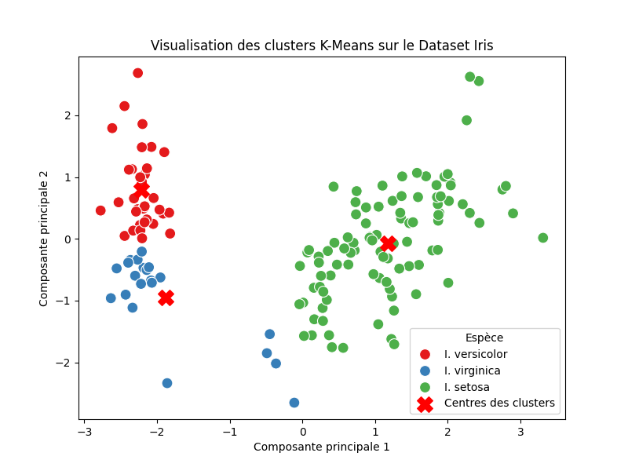

# Scraper du Dataset Iris depuis Wikipedia

## Description
Ce script Python permet de scraper les données du célèbre dataset Iris Flower Dataset directement à partir de la page Wikipedia Iris flower data set. Le script extrait le tableau contenant les informations sur les fleurs Iris (longueur et largeur des sépales et pétales pour 3 espèces de fleurs Iris) et le sauvegarde dans un fichier CSV pour une utilisation ou analyse ultérieure.

## Fonctionnalités
- Récupération automatique des données depuis Wikipedia à l'aide de la bibliothèque requests.
- Analyse du HTML avec BeautifulSoup pour localiser et extraire le tableau.
- Conversion des données extraites en un DataFrame pandas pour faciliter l'analyse.
- Sauvegarde des données dans un fichier CSV pour une utilisation ultérieure.


## Prérequis
Avant d'exécuter ce script, assurez-vous d'installer les bibliothèques suivantes :

```bash
pip install requests beautifulsoup4 pandas
```

## Utilisation
1. Clonez ou téléchargez ce dépôt.

2. Exécutez le script Python suivant :

```bash
python scrape_iris_dataset.py
```

3. Le script extraira les données et affichera les 5 premières lignes du dataset.

4. Les données seront également sauvegardées dans un fichier CSV nommé ``iris_flower_data.csv``.

## Exemple de sortie
Le script renverra les 5 premières lignes du dataset dans la console, comme suit :

```scss
   Sepal length (cm)  Sepal width (cm)  Petal length (cm)  Petal width (cm)            Species
0                5.1               3.5                1.4               0.2             setosa
1                4.9               3.0                1.4               0.2             setosa
2                4.7               3.2                1.3               0.2             setosa
3                4.6               3.1                1.5               0.2             setosa
4                5.0               3.6                1.4               0.2             setosa
```

## Fichiers

- ``scrape_iris_dataset.py``: Le script principal pour scraper les données.
- ``iris_flower_data.csv``: Le fichier CSV contenant les données extraites (si sauvegardé).


# Analyse des Clusters avec K-Means

## Description
Ce script Python permet d'effectuer un clustering K-Means sur le dataset Iris (récupéré via le script précédent) et de visualiser les clusters dans un graphique en 2D. Il utilise l'algorithme K-Means de scikit-learn pour diviser les données en 3 clusters (correspondant aux 3 espèces d'Iris), puis réduit la dimensionnalité des données à l'aide de PCA (Analyse en Composantes Principales) pour permettre une visualisation claire.

## Fonctionnalités
- Chargement des données Iris à partir du fichier CSV iris_flower_data.csv.
- Application de l'algorithme K-Means pour diviser les données en 3 clusters.
- Réduction de la dimensionnalité des données à 2 dimensions avec PCA pour faciliter la visualisation.
- Visualisation des clusters et de leurs centres dans un graphique 2D à l'aide de matplotlib et seaborn.
- Attribution des noms des espèces aux clusters (I. setosa, I. versicolor, I. virginica) dans la légende du graphique.

## Prérequis
Avant d'exécuter ce script, assurez-vous d'installer les bibliothèques suivantes :

```bash
pip install pandas matplotlib seaborn scikit-learn
```

## Utilisation

1. Exécutez le script Python suivant après avoir généré le fichier CSV avec le premier script :
```bash
python kmeans-cluster.py
```

2. Le script appliquera K-Means sur les données et affichera un graphique montrant les clusters et leurs centres.
3. Les espèces des fleurs seront associées aux clusters dans la légende du graphique.

## Exemple de sortie
Un graphique de dispersion sera affiché, montrant les données des fleurs Iris dans un espace réduit à 2 dimensions avec les clusters colorés en fonction de l'espèce de chaque fleur. Les centres des clusters seront marqués par des X rouges.



## Fichiers
kmeans-cluster.py: Le script principal pour effectuer le clustering K-Means et afficher les clusters.